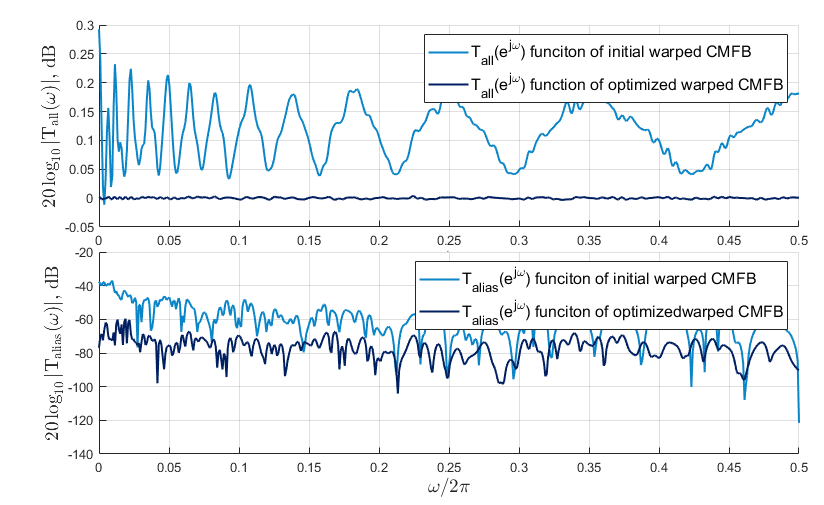

# Warped cosine-modulated filter bank design


## 1. The package

The package contains a Matlab implementation of the method for   warped cosine-modulated filter bank (WCMFB) design presented in _Vashkevich, M. Wan, W. and Petrovsky, A. [Practical design of multi-channel oversampled warped cosine-modulated filter banks](https://ieeexplore.ieee.org/document/6194801) Proc. of IET International Communication Conference on Wireless Mobile and Computing (CCWMC-2011), pp. 44-49, Shanghai, China,  14-16 Nov., 2011._ 

See also: http://arxiv.org/abs/1111.0737


## 2. Files & functions  


* `main_script.m`         - Contains an example of practical design of warped cosine-modulated filter bank.

* `warped_cmfb_opt_matlab_solver.m`     - function that optimizes coefficients of filter prototype using matlab solver `fminunc`.

* `wcmfb_cost_function.m`       - function for calculation of value, gradient and Hessian of error function.

The purpose of other functions can be easily understood from the context.


## 3. Warped cosine-modulated filter bank (+design example) 

### 3.1 Basic principle


### 3.2 Filter prototype optimization
- 12-channel filter bank
- Sampling frequency _fs_= 16 kHz
- Subsampling factors _Sk_= [30  14  10  7  6  4  3  2  2  1  1  1]


#### Filter prototype optimization


#### Transfer function ( + aliasing transfer function)


#### Filter bank magnitude response


#### Group delya (analysis/synthesis)


## 4. Cite
_Bibtex_
```
@inproceedings{WCMFB_2011, 
author={M. {Vashkevich} and W. {Wan} and A. {Petrovsky}}, 
booktitle={IET International Communication Conference on Wireless Mobile and Computing (CCWMC 2011)}, 
title={Practical design of multi-channel oversampled warped cosine-modulated filter banks}, 
year={2011}, 
pages={44-49}, 
doi={10.1049/cp.2011.0844}, 
month={Nov}
}
```